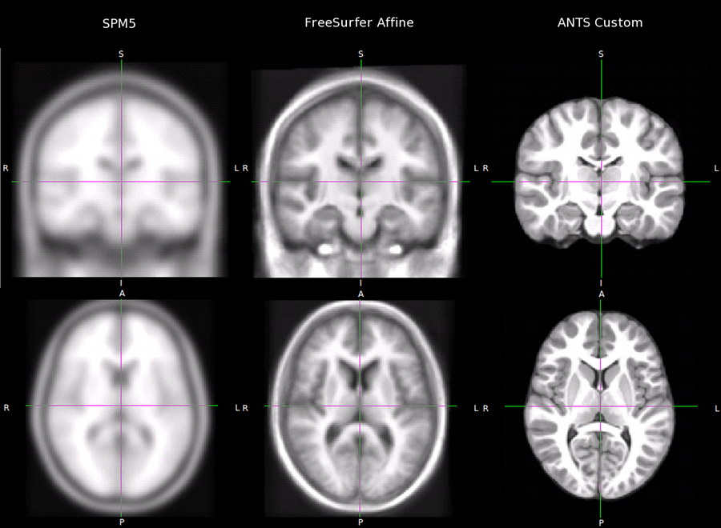

.. _pubdata:

=========================
Supplementary Information
=========================

ANTS Pediatric template
=======================

Ghosh et al. (in press). Evaluating the Validity of Volume-Based and
Surface-Based Brain Image Registration for Developmental Cognitive
Neuroscience Studies in Children 4-to-11 Years of Age. Neuroimage

Pediatric Template
------------------

`Download Template <../../_static/ANTS_pediatric.nii.gz>`_

.. image:: http://i.creativecommons.org/l/by/3.0/us/80x15.png

This work is licensed under a `Creative Commons Attribution 3.0 United
States License <http://creativecommons.org/licenses/by/3.0/us/>`_.

Details
=======

Participants
------------

31 participants aged 4.2 to 11 years of age.

Data acquisition
----------------

MPRAGE sequence on a Siemens Magnetom Trio 3T scanner (16 subjects: TR: 2350 ms, TE: 3.45 ms, TI: 1100ms, Flip angle: 7 deg; 15 subjects: TR: 2000 ms, TE: 3.39 ms, TI: 900ms, Flip angle: 9 deg; GRAPPA: x2). 

Template creation parameters
----------------------------

Processed using ANTS [http://www.picsl.upenn.edu/ANTS/]

 ============== ======================
 TRANSFORMATION SyN[0.5]
 ITERATLEVEL    30x99x11
 REGULARIZATION Gauss[2,0]
 METRIC         PR[ METRICPARAMS=1,2 ]
 ITERATIONS     6
 ============== ======================

The following steps were performed to ensure this download was in MNI space.

::

  mri_convert template.nii.gz template.nii.gz --out_orientation LAS
  flirt -in template.nii.gz -ref MNI152_T1_1mm_brain.nii.gz  \
      -out ANTS_pediatric.nii.gz 

Comparison
----------

The figure below compares SPM 5 template (T1.nii), FreeSurfer affine template (average/711-2C_as_mni_average_305.4dfp.img) and the above custom ANTS template.

.. include:: ../../links.txt
